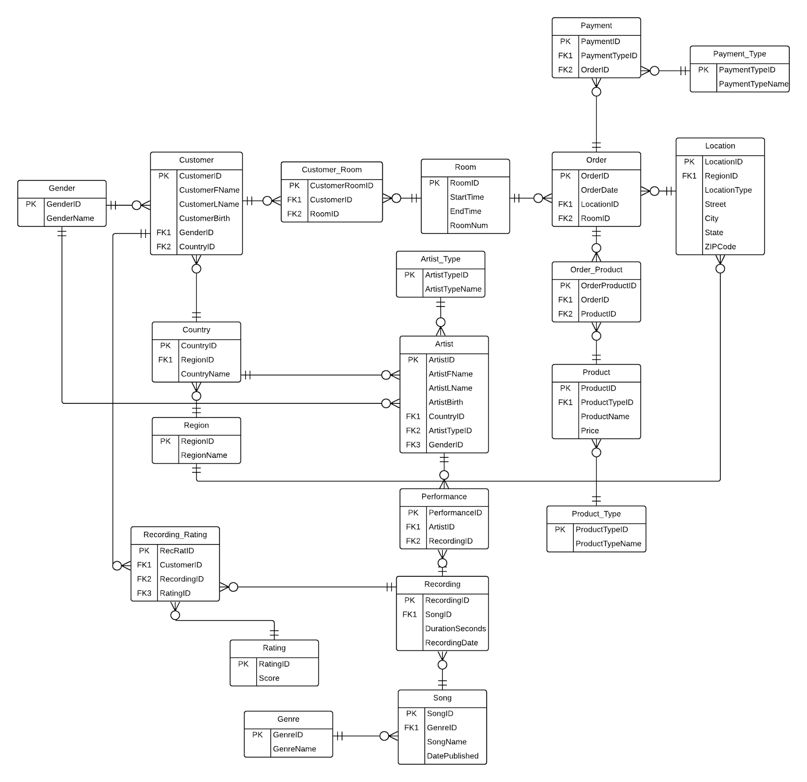
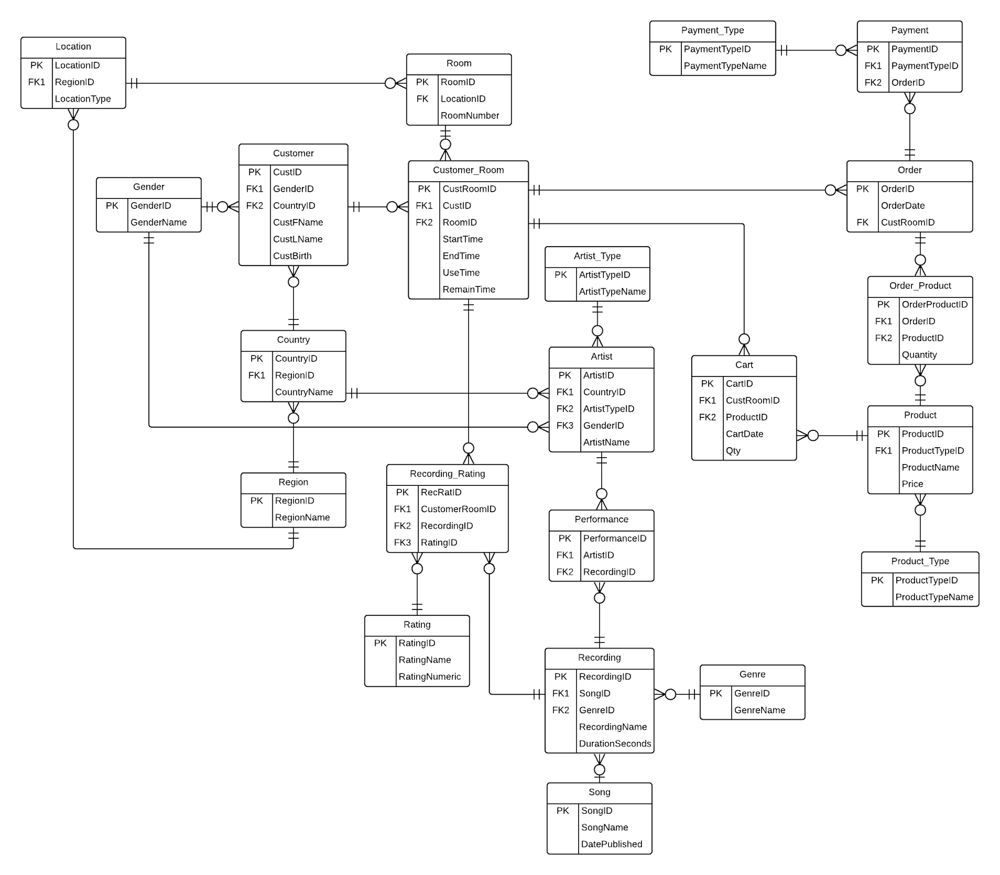

# KARAOKE STORE DATABASE

---
**In this project, we aimed to improve the business of a Karaoke Chain Store by building a database. This allows us to collect information and analyze who our frequent customers tend to be, what genre of songs do they like to sing, what types of alcohol or snacks do they like to order, and finally at what types of locations should we place our stores.**

---

This is our Initial ERD:

Our idea was that Karaoke stores are oriented by three core aspects: customer, recordings, and order. 

First off, the Customer table is connected to the Room table through  the bridge table named Customer_Room since one or more Customers can have one or more Rooms and vice versa. This keeps track of what Rooms the Customers are currently using.

Next, we originally thought that the Rooms where the customers are could directly Order food and drinks, and that an Order, as shown in the Payment table, can be paid in various ways like cash, cards, etc. This can help track what types of snacks and drinks Customers most often ordered in the store.

Lastly, we use the Recording table to answer questions like "What artist's songs are most often sang in our store? What are the most popular genres of songs that we should consider update often? What types of songs tend to get the highest ratings?" To clarify, Customers are given a rating score from the scale of 0-5 for each song they sing, which is logged in Recording_Rating. This table can show what songs tend to "easily" earn singers a high score, so Customers can pick those to impress their friends.

After discussing with our instructor, we realized that connecting Order to Room is impractical because doing so means each Room can only take one Order ever. We should instead connect it to Customer_Room since it gives us complete information of who is in what Room for how long. It was also not viable to connect Order to Location since Order inherently does not have a Location but Rooms do, so we moved the Location table to the other side. 

Another major issue is that Customer was connected to the Recording_Rating which is bad because Rating is assigned to a Room that the Customer is in,  which is why we switched its connection to Customer_Room.

This is our Revised ERD that we used to code this project:

Thank you for reading!